# Account Management {#intro}

## Registering a new account

::: two-col
```{r, echo=F, fig.cap=c("Register link on the Data Portal home page")}

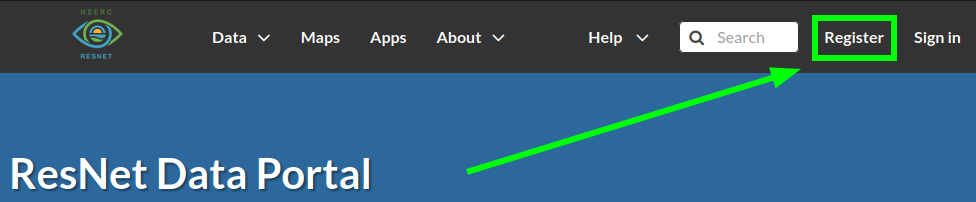

```

To get started, navigate to the [ResNet Data Portal](https://data.nsercresnet.ca "ResNet Data Portal"){target="_blank"} and click "Register" in the top right.
:::

::: two-col
```{r, echo=F, fig.cap=c("Sign up form")}

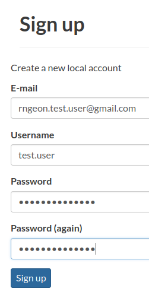

```

Fill in the form:

-   [E-mail]{.ul}: Address to affiliate with your account. This is where the system will send notifications.
-   [Username]{.ul}: Your username should follow the pattern `firstname.lastname` (eg `john.clark`).
-   [Password]{.ul}: Create a strong password unique to this account. Consider using a password manager like [Bitwarden](https://bitwarden.com/).
:::

::: {.infobox .info}
Email notifications are sent from `resnet.data.portal@gmail.com`. Remember to check your spam folder!
:::

::: two-col
```{r, echo=F, fig.cap=c("Account pending approval")}

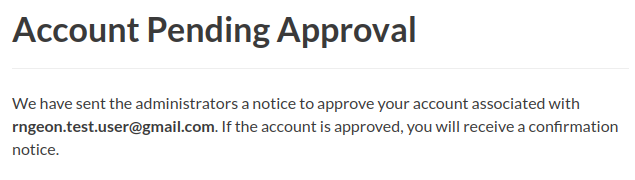

```

Once you've signed up, a notification will be sent to the Data Portal Administrators to activate your new account. This may take some time (normal working hours).
:::

::: two-col
```{r, echo=F, fig.cap=c("Account activated")}

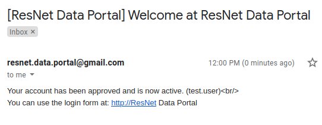

```

After your account has been activated, you will receive an email notification.
:::

::: {.infobox .info}
At the time of writing, this email notification includes an invalid link. You can still navigate to <https://data.nsercresnet.ca> and login as normal.
:::

::: two-col
```{r, echo=F, fig.cap=c("Sign in location")}

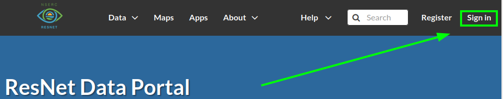

```

```{r, echo=F, fig.cap=c("Sign in prompt")}

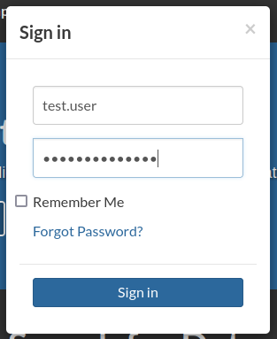

```

You can now sign in to the Data Portal using the credentials you've created.
:::

## Managing your profile

<!-- <div class="two-col"> -->

<!-- ```{r, echo=F, fig.cap=c("Navigate to profile")} -->

<!-- 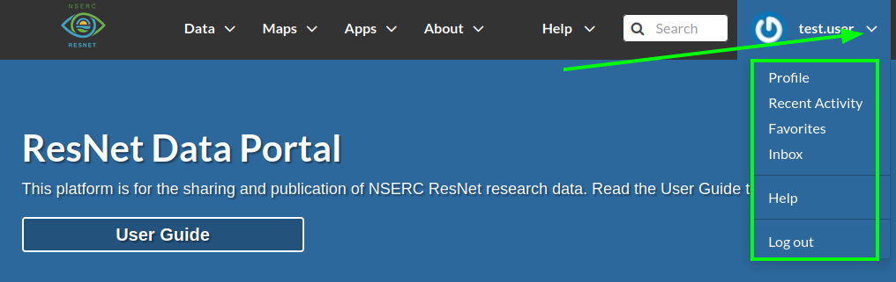 -->

<!-- ``` -->

<!-- ```{r, echo=F, fig.cap=c("View profile")} -->

<!-- 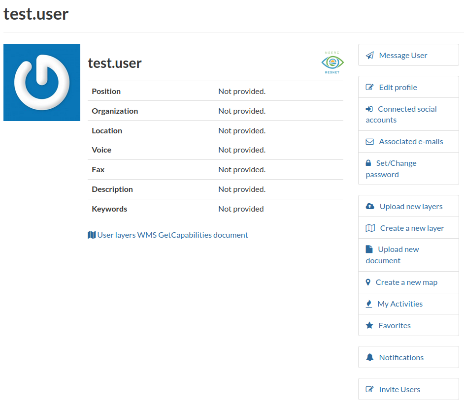 -->

<!-- ``` -->

<!-- ```{r, echo=F, fig.cap=c("Edit profile")} -->

<!-- 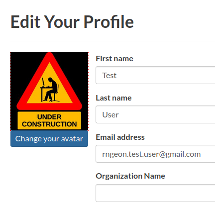 -->

<!-- ``` -->

From your user profile you can:

-   Customize your appearance (set a display name, add an avatar image)
-   Manage your Data Portal preferences (notifications)
-   View your activity and content (recent uploads, Layers)

See the [GeoNode documentation](https://docs.geonode.org/en/3.2.x/usage/accounts_user_profile/updating_profile/index.html){target="_blank"} for more information about your user profile.

<!-- </div> -->

::: three-col
```{r, echo=F, fig.cap=c("Navigate to profile")}


```

```{r, echo=F, fig.cap=c("View profile")}


```

```{r, echo=F, fig.cap=c("Edit profile")}


```
:::

<!-- [Navigation](#navigation) -->

## Joining a group

Groups have been created for each ResNet Landscape and Theme. Additional groups may be created for specific projects or for the special handling of sensitive data.

Layers assigned to a group are visible to all group members. Group Managers moderate activity within a Group and review associated content. A Group Manager must `Approve` a layer for publication before it is visible to users outside of the Group.

Layers can be assigned to a Group through the Metadata Wizard. See [Basic Metadata: Group](#page-1-basic-metadata).

::: two-col
```{r, echo=F, fig.cap=c("Navigate to groups")}

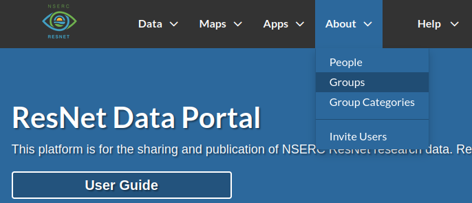

```

Navigate to `About > Groups`.
:::

::: two-col
```{r, echo=F, fig.cap=c("Browse groups")}

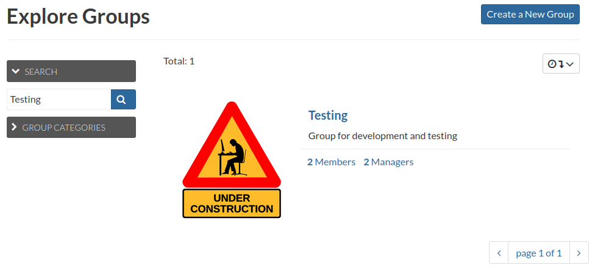

```

Locate the group by searching or browsing through pages. Click on a group to view details.
:::

::: two-col
```{r, echo=F, fig.cap=c("Group details")}

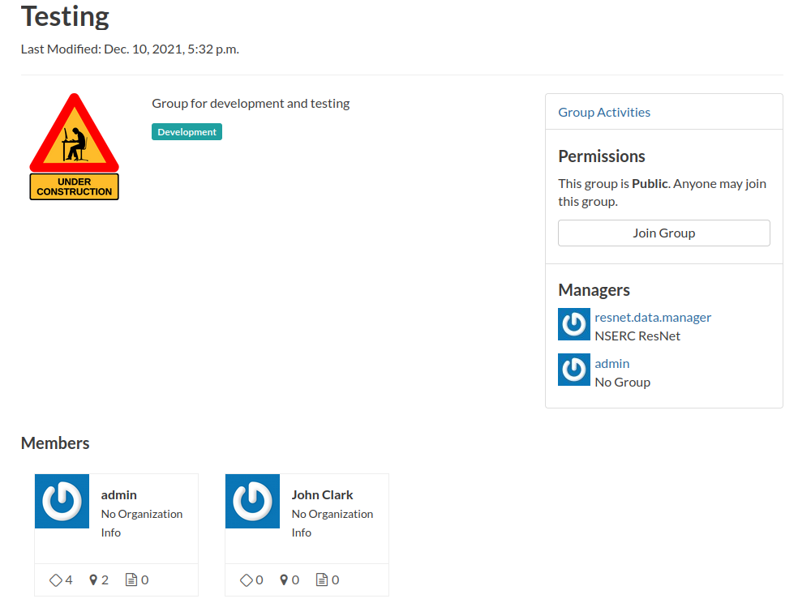

```

Click `Join Group` to join the group.
:::
