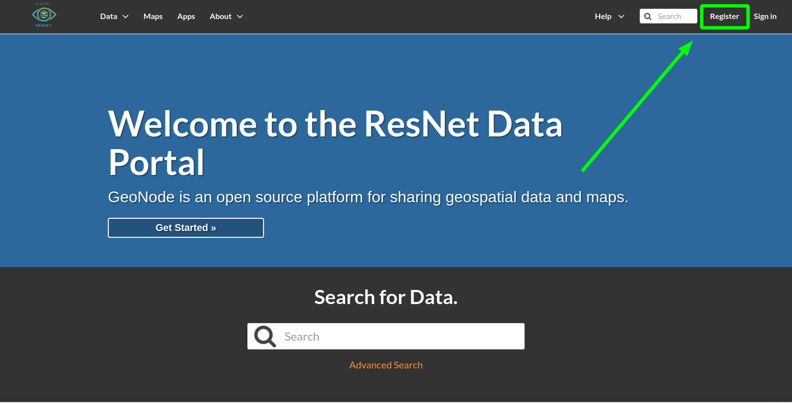

# Account Management {#intro}

## Registering a new account

To get started, navigate to data.nsercresnet.ca and click "Register" in the top right.

-   [E-mail]{.ul}: Address to affiliate with your account. This is where the system will send notifications.
-   [Username]{.ul}: Your username should follow the pattern `firstname.lastname` (eg `john.clark`).
-   [Password]{.ul}: Create a strong password unique to this account. Consider using a password manager like [Bitwarden](https://bitwarden.com/).

::: {.infobox .info}
Email notifications are sent from `resnet.data.portal@gmail.com`. Remember to check your spam folder!
:::

[Navigation](#navigation)

## Updating your profile

## Joining a group

