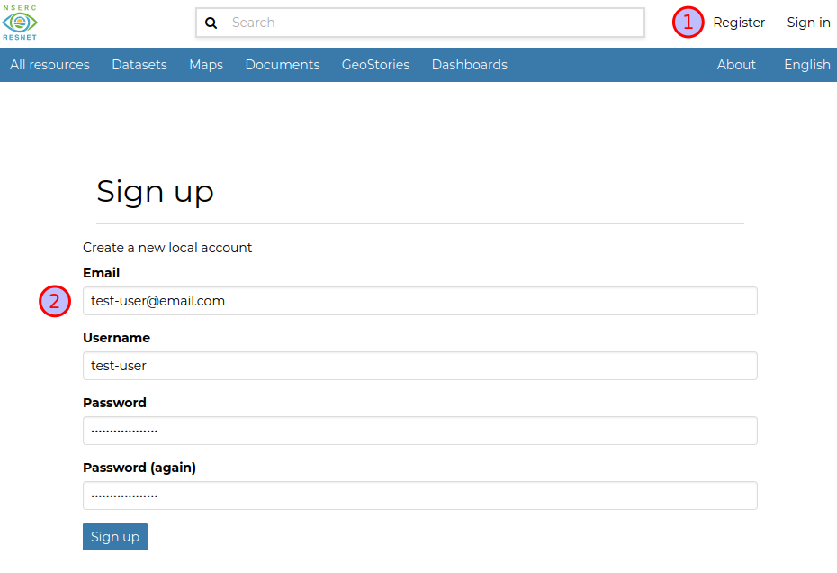
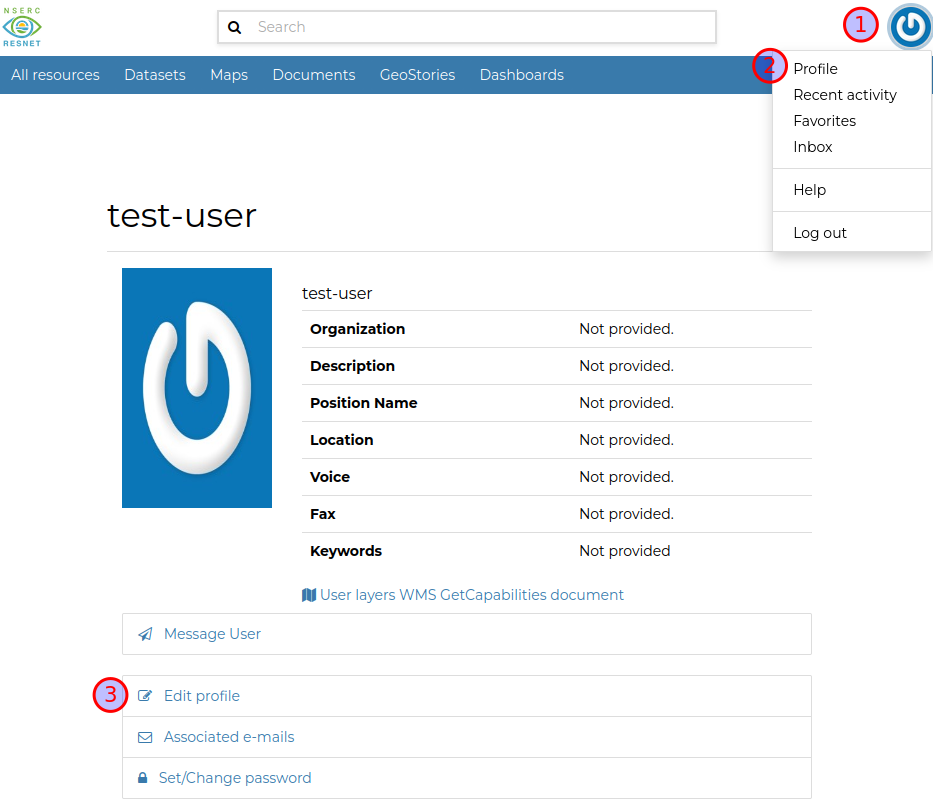
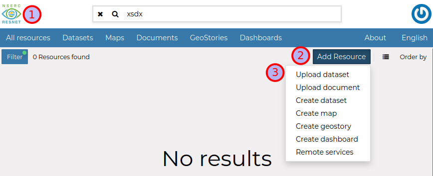
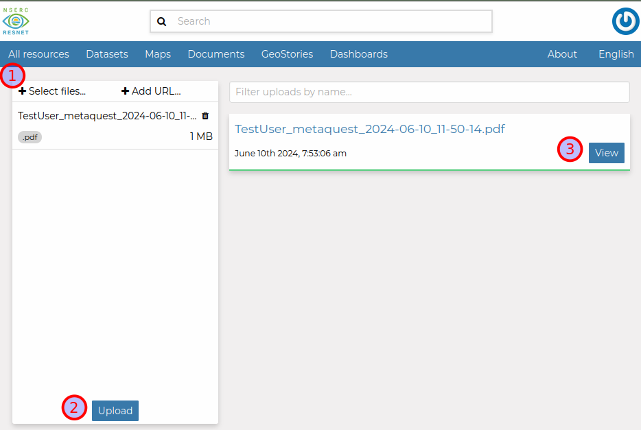
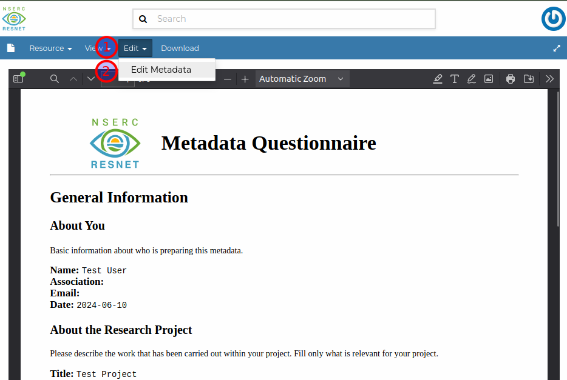
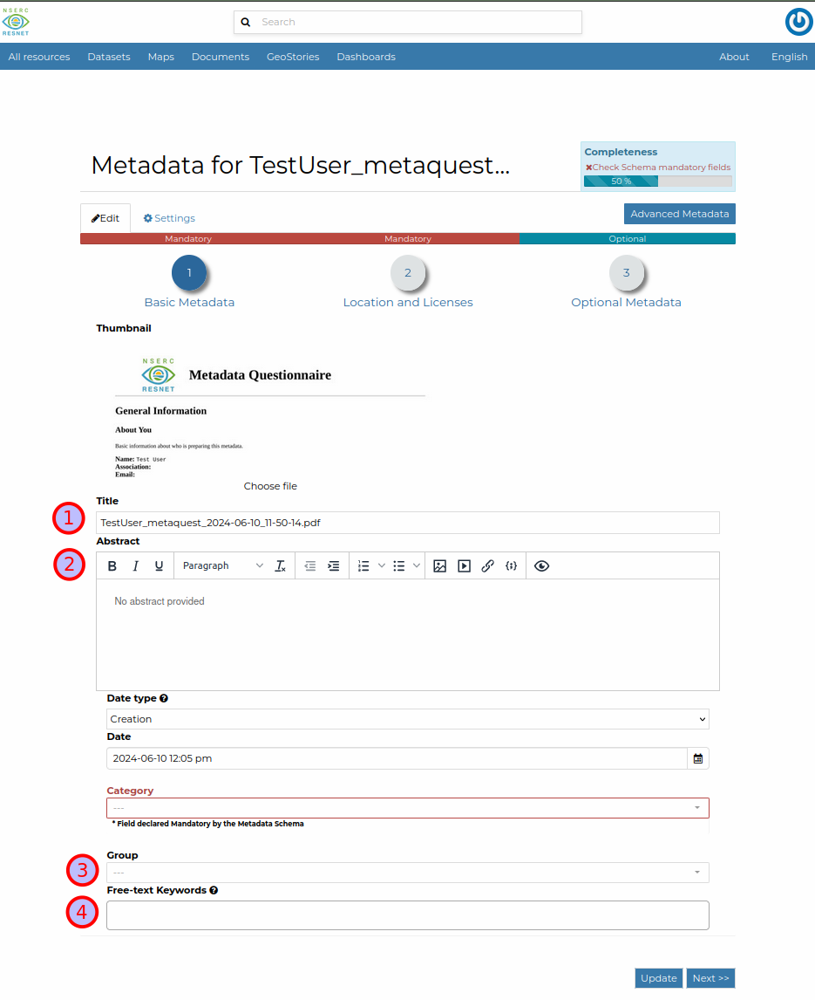
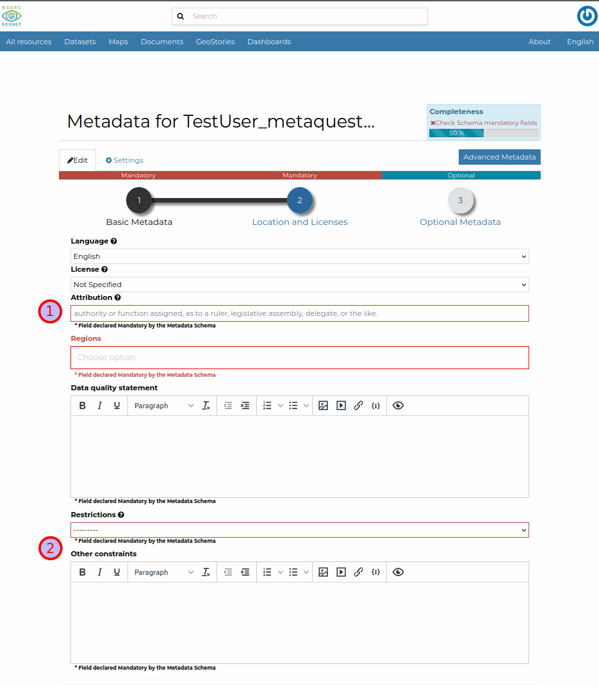
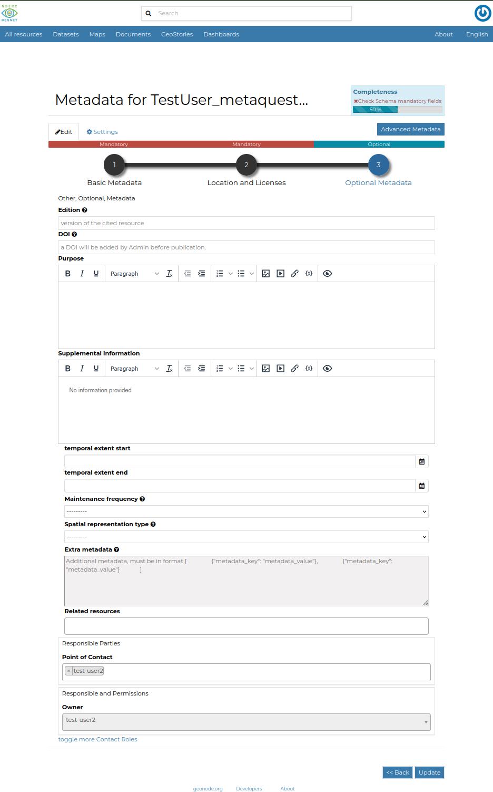
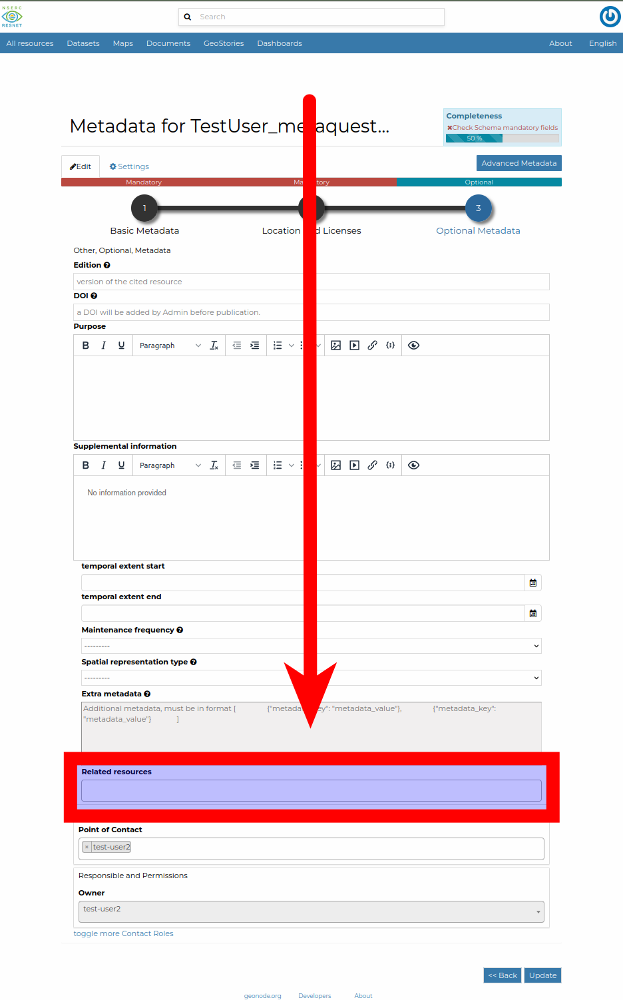
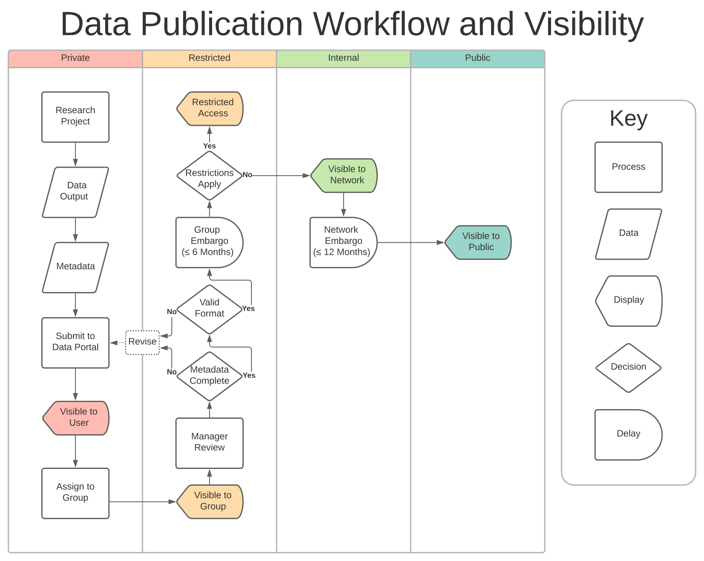

# User Quick Start {#quick-start}

This guide will walk you through the steps of documenting your research project using the [Metadata Questionnaire](https://apps.nsercresnet.ca/app/metaquest-main "Metadata Questionnaire"){target="_blank"}, uploading that document to the [ResNet Data Portal](https://data.nsercresnet.ca "ResNet Data Portal"){target="_blank"}, and submitting data layers and documents to the Data Portal.

For a more in-depth look at the Data Portal's features, please see the [Full User Guide](https://docs.geonode.org/en/4.3.0/usage/index.html "GeoNode User Guide"){target="_blank"}.

## Register for the Data Portal

::: two-col
```{r, echo=F, fig.cap=c("Register an account")}



```

1.  Navigate to the [ResNet Data Portal](https://data.nsercresnet.ca "ResNet Data Portal"){target="_blank"} and click `Register` to create an account (or `Sign in` if you already have one).

2.  Enter an email where you'd like to be contacted, a username such as `firstname_lastname`, and a strong password. Save this password somewhere safe.

```{r, echo=F, fig.cap=c("Edit user profile")}



```

3.  Click menu on the top right and then `Profile`. Click `Edit profile` and include your name and institution.
:::

## Write Project Metadata

1.  Navigate to the [Metadata Questionnaire](https://apps.nsercresnet.ca/app/metaquest-main "Metadata Questionnaire"){target="_blank"}.

2.  Carefully read the instructions included on that page.

3.  Complete all relevant sections of the form to the best of your ability.

4.  Remember to save your work! The questionnaire will create a PDF file. You need to save this to your computer and then upload it to the Data Portal.

5.  You can also upload this file back into the Metadata Questionnaire if you need to make changes.

## Upload Project Metadata to Data Portal

::: two-col
```{r, echo=F, fig.cap=c("Upload document")}



```

1.  From the Data Portal landing page, click `Add Resource -> Upload Document`.

```{r, echo=F, fig.cap=c("Upload document")}



```

2.  Click `Select Files` and choose the PDF file you saved from the Metadata Questionnaire in the previous step.

3.  Click `Upload` and once completed, click `View`.

```{r, echo=F, fig.cap=c("Edit metadata")}



```

4.  You can now see your document, but we need to make it easier for others to find by adding some basic metadata. Click `Edit -> Edit Metadata`

5.  Fill in basic information, click `Next` to proceed through pages of the wizard, and click `Update` to save your changes.

6.  While not everything may be applicable, there are several important fields all uploads should include:
:::

> Title: Replace the filename with a concise, descriptive title (eg 'Wave Dissipation Potential of Spartina alterniflora in the Bay of Fundy').
>
> Abstract: Copy over the abstract from your Project Metadata document.
>
> Group: Your ResNet Landscape or Theme. Please note, you may need to be invited to a group before you can assign resources to it.
>
> Free-text Keywords: A free form space to associate descriptive keywords with your data. Multiple keywords can be added. Use your best judgement to assign terms that will help users discover data relevant to their interests.
>
> Attribution: Include additional authors and primary contributors.
>
> Other constraints: Any restrictions on publishing or sharing this data. Copy over from your Project Metadata PDF as needed.

::: three-col
```{r, echo=F, fig.cap=c("Document metadata part 1")}



```

```{r, echo=F, fig.cap=c("Document metadata part 2")}



```

```{r, echo=F, fig.cap=c("Document metadata part 3")}



```
:::

## Upload Data Layers and Documents to Data Portal

1.  Now that you've uploaded your Project Description, it's time to add data and documents related to your project.

2.  For spatial data, click `Add Resource -> Upload dataset` . Supported formats include ESRI shapefile, GeoJSON, and GeoTIFF. Note, files larger than 150 mb may fail to upload. Contact the Data Manager for assistance with getting these files onto the portal.

3.  For non-spatial data, qualitative data, and supporting documents, click `Add Resource -> Upload document`. These can include documents, spreadsheets, multimedia, and zipped archives.

4.  Once an item has finished uploading, view the resource and click `Edit -> Edit Metadata`. Complete the form like you did for the the project description in the previous section. Make sure to add your Project Metadata under `Related resources`. This will create link between your project and any associated items.

::: two-col

```{r, echo=F, fig.cap=c("Document metadata: related resources")}


```

> Title: Replace the filename with a concise, descriptive title (eg 'Wave Dissipation Potential of Spartina alterniflora in the Bay of Fundy').
>
> **Abstract: Copy over the relevant `Data Description` field from your Project Metadata document. It should be specific to the dataset, rather than for the overall project.**
>
> Group: Your ResNet Landscape or Theme. Please note, you may need to be invited to a group before you can assign resources to it.
>
> Free-text Keywords: A free form space to associate descriptive keywords with your data. Multiple keywords can be added. Use your best judgement to assign terms that will help users discover data relevant to their interests.
>
> Attribution: Include additional authors and primary contributors.
>
> Other constraints: Any restrictions on publishing or sharing this data. Copy over from your Project Metadata PDF as needed.
>
> **Related resources: Select your Project Description. This will create a collection of resources associated with your project!**

:::

## Deleting Data Portal Resources

1.  You may want to delete resources you've uploaded to remove them from the Data Portal. For instance, if you've uploaded files to test out this workflow or need to replace them with an updated version. **Unfortunately, users may be unable to delete their own uploads.** This is a trade off between flexibility and compliance with the Network Data Policy.
2.  As a work around, please indicate resources for deletion by prepending `DELETE` to the title. E.g., `Test Resource` -> `DELETE Test Resource`. A Data Portal Administrator or Group Manager will delete the resource for you.

## Finalize and Publish

1.  Initially, your data and documents will only be visible to you (and the Data Portal administrators).

2.  Once assigned to a Group, the resource will be visible to all group members.

3.  After you've completed the previous steps, send an email to the Data Manager:

> to: `resnet.data.portal@gmail.com`\
> subject: `Your landscape/theme: your project title`\
> body: `List of resources ready for review`

3.  We'll review the submission together, request changes if needed, and finalize your submission.

4.  Once the submission is finalized, and if there are no restrictions due to data sensitivity or publication embargo, the layer will be made visible to the public.

```{r, echo=F, fig.cap=c("Data publication workflow")}



```
