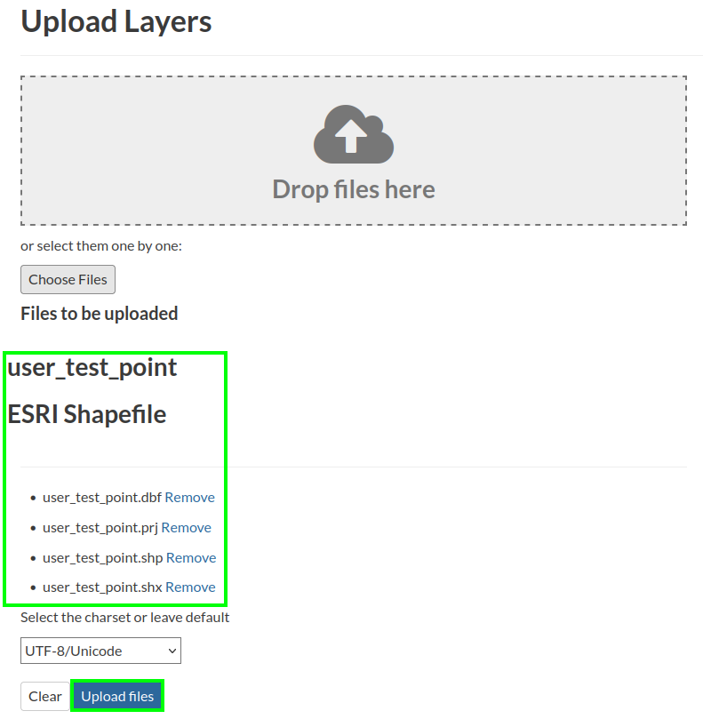
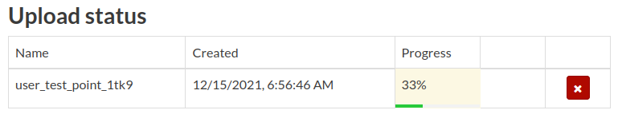
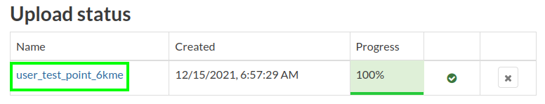
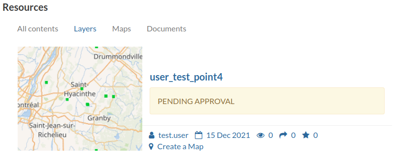
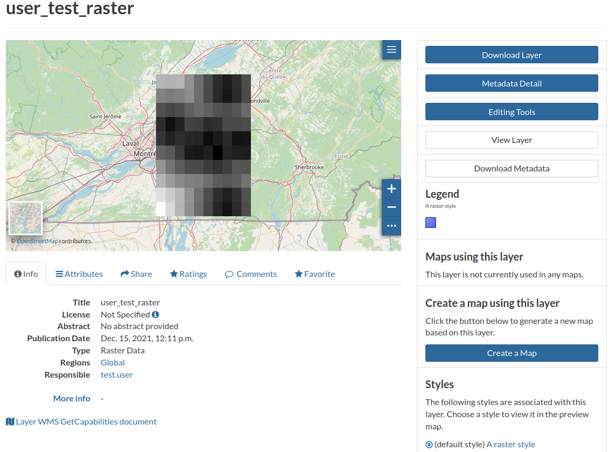
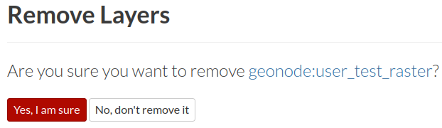
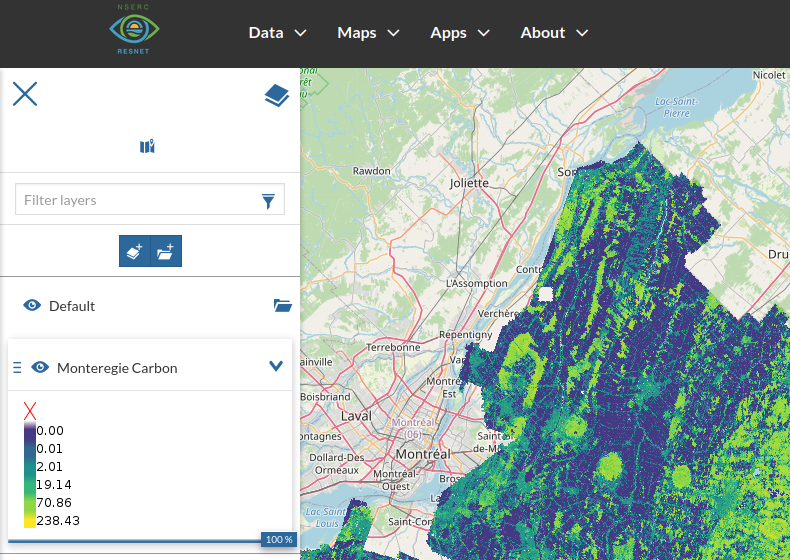
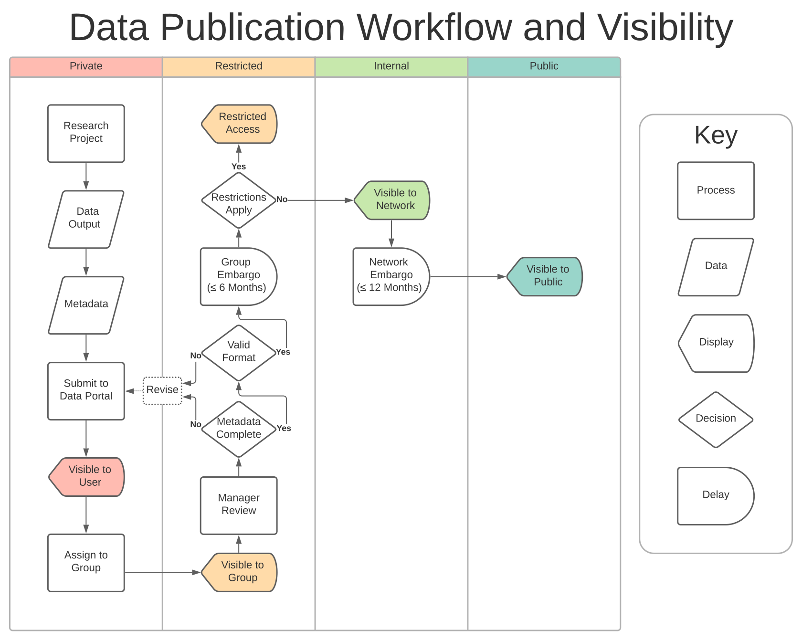

# Data Layers

## Preparing data

Preparing your data for submission is critical. It's much easier to get your data into a clear, workable, standardized format on your local machine, rather than attempting to modify it after submission to the Data Portal.

Emphasis is placed on geospatial data, but many other types of data can be submitted to the Data Portal as well. See [Other Data Types](#other).

Data preparation (and management) are extensive topics. We'll lay out the basics and some quick tips here, and cover these aspects in greater depth in the future.

### General

#### Filenaming

Using clear, descriptive, and compatible filenames for your data is an important aspect of data management. Inappropriate filenames are not only confusing, they may also cause issues within the Data Portal that render the layer unusable. Follow the best practices below for best results.

Descriptive: A succinct, descriptive filename is important for identifying and managing datasets.

Length: Excessively long filenames can trigger unexpected behavior. Try to limit your filenames to about 20 characters.

Characters: A filename with non-standard characters can trigger errors. Stick with these guidelines.

-   Use basic Latin alphanumerics (a-z, A-Z, 0-9)

-   Do not include characters with diacritics/accent marks (`ñ`)

    -   The data itself can contain non-basic Latin characters, but it's still important to be aware of character encoding. [This blog](https://www.joelonsoftware.com/2003/10/08/the-absolute-minimum-every-software-developer-absolutely-positively-must-know-about-unicode-and-character-sets-no-excuses/){target="_blank"} will tell you more than you wanted to (but should) know.

-   Use dashes (`-`) or underscores (`_`) to separate terms

-   Only use periods (`.`) before the file extension

-   Avoid including spaces/blank spaces ()

Unique: If a filename matches that of an existing layer, the Data Portal automatically appends random characters to the filename. Include a version number in your filename if you'd like to avoid this.

#### Size limitations

Data files larger than 1gb will fail to upload to the Data Portal, and files approaching that limit may experience issues.

<!-- Raster datatype can help. Subsetting. Aggregation -->

Large, national-scale datasets (eg. landcover) may be available on public map servers hosted by external organization. Using these existing resources is a good way to bring large datasets into the Data Portal to combine with internal layers, without worrying about size limitations. See [Adding Remote Services](#adding-remote-services).

If you've created a large research dataset that needs to be added to the Data Portal, coordinate with the [Data Manager](#getting-help).

### Projection

For an introduction and overview of spatial coordinate systems and projects, see this [ESRI article](https://pro.arcgis.com/en/pro-app/latest/help/mapping/properties/coordinate-systems-and-projections.htm){target="_blank"}

[EPSG Codes](https://en.wikipedia.org/wiki/EPSG_Geodetic_Parameter_Dataset){target="_blank"} are a succinct, standardized method for referencing common geospatial projections. Typically, the Data Portal will accept spatial data in any projection with a properly declared EPSG code. In practice, projection systems can be complex. Initially you may want to stick with one of the most common projections until you are more familiar with the Data Portal.

-   WGS84 ([EPSG:4326](https://epsg.io/4326){target="_blank"}). Basic longitude and latitude coordinates. Units are in decimal degrees.
-   Web Mercator ([EPSG:4326](https://epsg.io/4326){target="_blank"}). Commonly used to render data for web maps. Units are in meters. <!-- -statcan --> <!-- geographic conformal equidistant equal area -->

> *We'll cover projection fundamentals and best practices for transforming projections in a future workshop.*

<!-- -   distort matrix/indicator -->

<!-- #### Reprojecting -->

<!-- ##### Resampling -->

<!-- - Nearest neighbor -->

<!-- - Majority -->

<!-- - Bilinear -->

<!-- - Cubic -->

<!-- ##### Software -->

<!-- -   Esri -->

<!-- -   Qgis -->

<!-- -   Gdal -->

<!-- -   r -->

<!-- -   python -->

### Vector

The most common format for storing vector data is the [Shapefile](https://en.wikipedia.org/wiki/Shapefile){target="_blank"}.

<!-- geojson -->

<!-- csv -->

### Raster

The recommended format for storing and submitting raster data is [GeoTIFF](https://en.wikipedia.org/wiki/GeoTIFF){target="_blank"}.

<!-- Tip-get your data how you want it locally first. Datatype, min max na. -->

### Other {#other}

Non-geospatial datasets can be submitted to the Data Portal as Documents. File formats for Document objects include text files (.doc, .docx, .txt, .odt), spreadsheets (.xls, .xlsx, .ods), presentations (.ppt, .pptx, .odp), images (.gif, .jpg, .png, .tif, .tiff), PDF, zip files (.rar, .zip, .gz), SLD, XML or QML files.

Descriptive metadata is critical for the discovery and reusability of Document datasets, as the user will not be able to view the contents of a Document before downloading the file.

See [Documents](https://docs.geonode.org/en/3.2.x/usage/managing_documents/uploading_documents.html#uploading-documents){target="_blank"} in the GeoNode documentation for more information about uploading, managing, and creating metadata for Documents.

#### Tabular

> *We'll cover best practices for formatting and managing tabular data in a future workshop.*

<!-- Tidy xls, but csv better col types -->

## Uploading a new layer

::: two-col
```{r, echo=F, fig.cap=c("Upload layer from site menu")}

knitr::include_graphics("images/paste-9A422139.png")

```

Navigate to `Data > Upload Layer` from the top menu.
:::

::: two-col
```{r, echo=F, fig.cap=c("Select files to upload")}

knitr::include_graphics("images/paste-818A6058.png")

```

Click `Choose files` and navigate to the dataset on your local computer.

Select the data files to be uploaded.

If a dataset is composed of multiple files, be sure to select all associated files. For example, ESRI shapefiles, a common format for vector data, actually consist of four+ separate files)
:::

::: two-col
```{r, echo=F, fig.cap=c("Verify selection and upload")}



```

Confirm the result looks as intended.

Click the `Upload files` button.
:::

::: two-col
```{r, echo=F, fig.cap=c("Upload in progress")}



```

Monitor progress within `Upload status`.

If an error occurs:

-   Verify that you are able to display the data on your local computer
-   Recheck your file selection
-   Retry uploading the files
-   Get [help](#getting-help)
:::

::: two-col
```{r, echo=F, fig.cap=c("Upload completed successfully")}



```

```{r, echo=F, fig.cap=c("Layer info")}



```

If the upload completes successfully:

-   Initially, the layer will only be visible to you. You'll need to assign the layer to a Group before it can be viewed by any other registered users, and complete the Data Publication process before the data is publically available. See [Publishing Layers](#publishing-layers).
-   Proceed to [Managing Layers](#managing-layers) to customize the description and symbology of your layer.
:::

### Adding remote services {#adding-remote-services}

The Data Portal can integrate layers from external map servers, such as Geoserver Web Map Services (WMS) and ArcGIS REST MapServers. See [Using Remote Services](https://docs.geonode.org/en/3.2.x/usage/managing_layers/using_remote_services.html){target="_blank"} in the GeoNode documentation for details.

## Managing layers {#managing-layers}

See the GeoNode documentation for [Layer Info](https://docs.geonode.org/en/3.2.x/usage/managing_layers/layer_info.html){target="_blank"} and [Layer Tools](https://docs.geonode.org/en/3.2.x/usage/managing_layers/layer_info.html#layer-tools){target="_blank"}




### Remove layer

A layer can be removed through the Editing Tools. Navigate to a layer page, click `Editing Tools` to open menu, click `Remove`, and confirm. This action can only be performed by the `Owner` of the layer or a Data Portal Administrator.

::: three-col
```{r, echo=F, fig.cap=c("Layer editing tools")}

knitr::include_graphics("images/paste-8B2E52DA.png")

```

```{r, echo=F, fig.cap=c("Remove layer")}



```
:::

### Styling layer

::: two-col
```{r, echo=F, fig.cap=c("Viewing a layer")}



```

Layer styles control the appearance and visualization of data layers. A layer can have multiple styles associated with it. The Data Portal includes an interactive tool for creating geospatial styles. See [Layer Styling](https://docs.geonode.org/en/3.2.x/usage/managing_layers/layer_styling.html){target="_blank"} in the GeoNode documentation for detailed instructions.

> *We'll cover this in greater depth in a future workshop.*

<!-- Uploading SLD -->
:::

## Publishing layers {#publishing-layers}

1.  Upload a layer -> Layer pending approval

2.  Author [Metadata](#metadata)

3.  Assign to group -> Layer visible to group

4.  Request Group Manager review

5.  After Manager approval -> Visible to public

> *This protocol is still in development. Please bear with us. Full details coming soon.*

### Publication Workflow

```{r, echo=F, fig.cap=c("Data publication workflow")}



```
