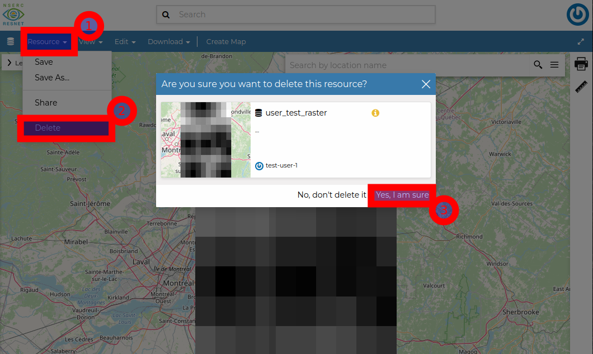

# Group Managers {#group-managers}

## What is a Group

Data Portal users and resources are organized by Group (ResNet Landscapes, Themes, and Synthesis). Groups are an important tool for:

-   **Organizing content**. Visitors to the Data Portal can filter resources by Group, making it easier to find relevant content.
-   **Controlling access**. Initially, uploaded resources are only visible to the uploader (and Data Portal Administrators). Once the user is assigned to a Group, resources will be visible to all Group members. Finally, once the Group Manager and Data Portal Administrator have reviewed the content and marked it as Approved, the content will be Published and visible to anyone visiting the Data Portal.

## What is a Group Manager

Data Portal users and resources need to be assigned to a Group by a Group Manager. Group Managers are typically Data Stewards (designated by the Group's PIs), or the PI directly. Every Group should have at least one Manager.

-   **Moderating membership**.
-   **Curating content**. Group managers curate content by ensuring resources are appropriate for sharing, and sufficiently described by resource metadata and project descriptions. Where needed, they'll ask users to revise their submitted resources and/or metadata.
-   **Communicating with Administrators**. Although users can contact the Data Portal Administrators directly, there may be issues or support requests they're unaware of. Please pass them along!

## Managing Group Membership

Groups are visible, but users must be invited to join a group. This is to prevent anonymous users from creating an account, joining a group without an invitation, and accessing resources that haven't been finalized/published to be publicly available. You should only add members (and their resources) to your group if you know who they are.

Navigate to the Group page, click `Manage Group Members`, and select the User from the list. Users were asked to create an account using the username format `firstname_lastname`, but this is not always what they've provided. You may need to ask the user what username they've created.

<!-- ### Add Members  -->

<!-- ### Remove Members  -->


<!-- ## Managing Group Resources -->

<!-- Edit permissions, save changes -->

## Assigning Group Managers

Group Managers should be designated by their Group. While multiple managers can be added to a group, all managers will be able to remove users and permanently delete resources and documentation, irreversibly. Please use caution. 

To add a Group Manager, you must be an existing Group Manager or Data Portal Administrator. Navigate to the Group page, click `Manage Group Members`, and click `Promote` for an existing user or add a new user with the `Assign manager role` option selected.

## Deleting Resources

::: two-col
```{r, echo=F, fig.cap=c("Deleting a resource")}



```
:::

-   Navigate to the resource and view it.
-   Select `Resource -> Delete`.
-   **This process cannot be reversed.**
