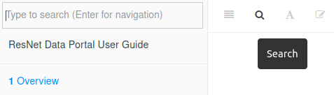

# Getting Help

## Search

Click the search button in the toolbar at the top of the page (or press the `F` key). Matching words will be grouped by section.

## Slack

The ResNet Slack is a great place for asking questions, sharing issues and solutions, and collaborating asynchronously.

Two channels relevant to the Data Portal are:

-   `@data-portal-users` - Discussions specific to using the Data Portal. Features, issues, shared content
-   `@data` - General questions about data. Best practices for processing and managing, analysis methods, sharing external data sources

## Data Office Hours

An informal time to drop in and chat about all things data: discovery, processing, analysis, visualization, development, publication... Brainstorm methods and troubleshoot workflows.

Typically on Wednesdays from 2-3pm ET over Slack. Contact John if you'd like to set something up then or any other time.

## Request Support

When requesting support, it's important to provide a detailed description of the problem you're facing and specific information about your situation. Below are some guidelines for writing an effective support ticket.

Always include:

-   Subject: A succinct description of the task you're attempting and the issue encountered.
    -   *Poor: "Can't see file"*
    -   *Good: "Data Portal - Unable to view layer after upload"*
-   Objective: What are you trying to do?
-   Issue: What obstacles or errors have you encountered?
-   Troubleshoot: Have you tried any other methods?
-   Supporting info: Screenshots, error codes etc.

If related to a dataset/layer, also include:

-   Format
-   Filename
-   File size
-   Projection (see [Projection](#projection))

If related to the Data Portal, also include:

-   Username
-   Date and time

Send your support request email to `resnet.data.portal@gmail.com`.

### Example

    from: test.user@email.com
    to: resnet.data.portal@gmail.com 
    subject: Data Portal - Unable to view layer after upload

    Hello,

    I uploaded a new layer to the Data Portal. The status page said the upload 
    completed, but now I'm unable to view it. This happened around 2pm EST on 
    2021-12-14. I retried uploading the layer but am still unable to view it.

    [screenshot]

    - username: test.user
    - filename: user.test.raster.tif
    - format: GeoTiff
    - size: 1.2kb
    - projection: WGS84 (EPSG:4326)

    Cheers,
    Test User

<!-- ## External Resources -->

<!-- -   GeoNode User Guide -->
