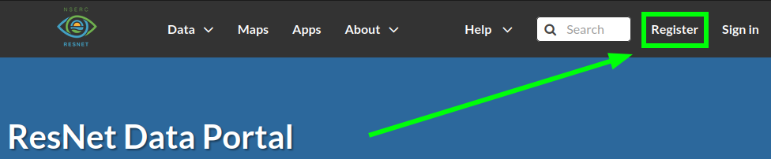
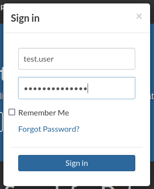
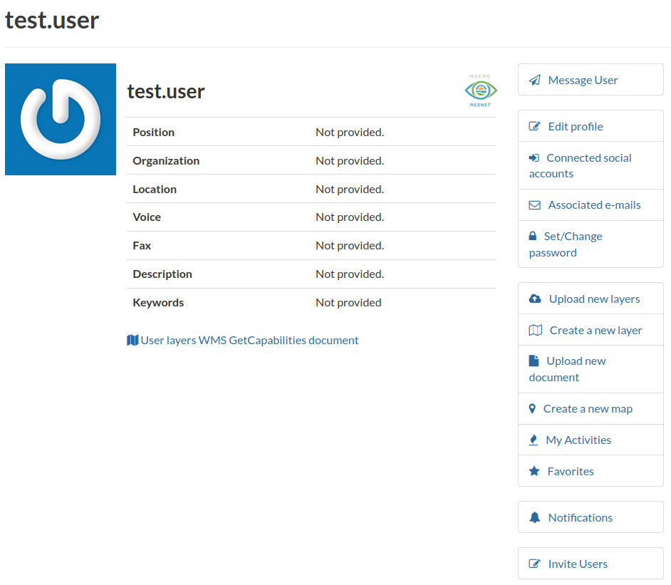
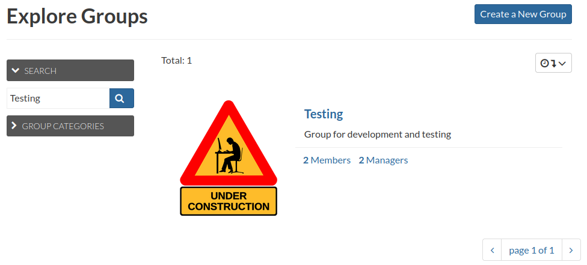
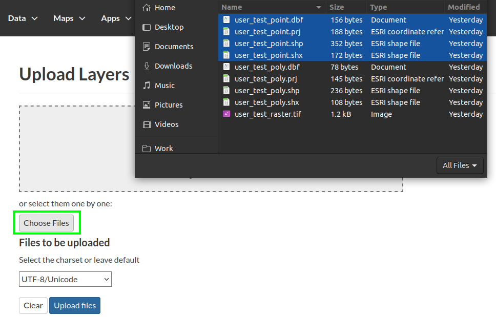
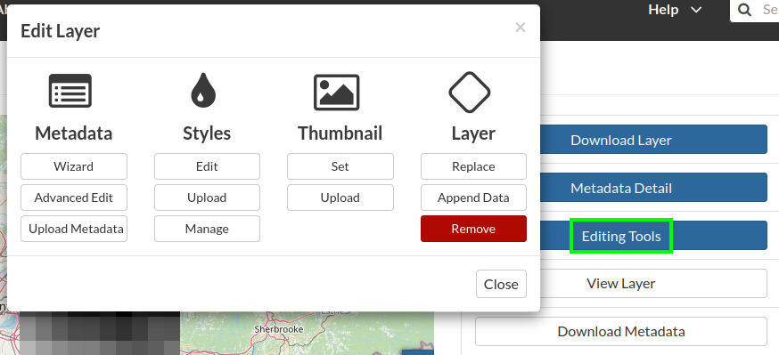
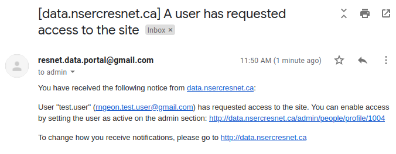
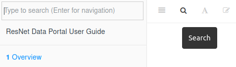

# Overview

Purpose of Data Portal

The ResNet Data Portal was developed using [GeoNode](https://geonode.org/){target="_blank"}, an open-source platform for sharing geospatial maps and data. This document is intended to summarize and supplement the official [GeoNode Documentation](https://docs.geonode.org/en/3.2.x/usage/index.html){target="_blank"}.

<!-- Living document -->

<!-- report issues, submit content via github -->

<!-- anchor links -->

<!-- ## Navigation -->

<!-- ## Getting started -->

<!-- 1.  Register a new account. Activation required. -->

<!-- 2.  Upload layer -->

<!-- 3.  Combine -->

<!-- 4.  Manage -->

<!-- 5.  Publish -->

<!--chapter:end:index.Rmd-->

# Account Management {#intro}

## Registering a new account

::: two-col
```{r, echo=F, fig.cap=c("Register link on the Data Portal home page")}



```

To get started, navigate to the [ResNet Data Portal](https://data.nsercresnet.ca "ResNet Data Portal"){target="_blank"} and click "Register" in the top right.
:::

::: two-col
```{r, echo=F, fig.cap=c("Sign up form")}

knitr::include_graphics("images/paste-E2DD497C.png")

```

Fill in the form:

-   [E-mail]{.ul}: Address to affiliate with your account. This is where the system will send notifications.
-   [Username]{.ul}: Your username should follow the pattern `firstname.lastname` (eg `john.clark`).
-   [Password]{.ul}: Create a strong password unique to this account. Consider using a password manager like [Bitwarden](https://bitwarden.com/).
:::

::: {.infobox .info}
Email notifications are sent from `resnet.data.portal@gmail.com`. Remember to check your spam folder!
:::

::: two-col
```{r, echo=F, fig.cap=c("Account pending approval")}

knitr::include_graphics("images/paste-BD582B1A.png")

```

Once you've signed up, a notification will be sent to the Data Portal Administrators to activate your new account. This may take some time (normal working hours).
:::

::: two-col
```{r, echo=F, fig.cap=c("Account activated")}

knitr::include_graphics("images/paste-C4CF7960.png")

```

After your account has been activated, you will receive an email notification.
:::

::: {.infobox .info}
At the time of writing, this email notification includes an invalid link. You can still navigate to <https://data.nsercresnet.ca> and login as normal.
:::

::: two-col
```{r, echo=F, fig.cap=c("Sign in location")}

knitr::include_graphics("images/paste-0E1A69DA.png")

```

```{r, echo=F, fig.cap=c("Sign in prompt")}



```

You can now sign in to the Data Portal using the credentials you've created.
:::

## Managing your profile

<!-- <div class="two-col"> -->

<!-- ```{r, echo=F, fig.cap=c("Navigate to profile")} -->

<!-- knitr::include_graphics("images/paste-FB2F4661.png") -->

<!-- ``` -->

<!-- ```{r, echo=F, fig.cap=c("View profile")} -->

<!--  -->

<!-- ``` -->

<!-- ```{r, echo=F, fig.cap=c("Edit profile")} -->

<!-- knitr::include_graphics("images/paste-490F3811.png") -->

<!-- ``` -->

From your user profile you can:

-   Customize your appearance (set a display name, add an avatar image)
-   Manage your Data Portal preferences (notifications)
-   View your activity and content (recent uploads, Layers)

See the [GeoNode documentation](https://docs.geonode.org/en/3.2.x/usage/accounts_user_profile/updating_profile/index.html){target="_blank"} for more information about your user profile.

<!-- </div> -->

::: three-col
```{r, echo=F, fig.cap=c("Navigate to profile")}

knitr::include_graphics("images/paste-FB2F4661.png")

```

```{r, echo=F, fig.cap=c("View profile")}


```

```{r, echo=F, fig.cap=c("Edit profile")}

knitr::include_graphics("images/paste-490F3811.png")

```
:::

<!-- [Navigation](#navigation) -->

## Joining a group

Groups have been created for each ResNet Landscape and Theme. Additional groups may be created for specific projects or for the special handling of sensitive data.

Layers assigned to a group are visible to all group members. Group Managers moderate activity within a Group and review associated content. A Group Manager must `Approve` a layer for publication before it is visible to users outside of the Group.

Layers can be assigned to a Group through the Metadata Wizard. See [Basic Metadata: Group](#page-1-basic-metadata).

::: two-col
```{r, echo=F, fig.cap=c("Navigate to groups")}

knitr::include_graphics("images/paste-6F9677B0.png")

```

Navigate to `About > Groups`.
:::

::: two-col
```{r, echo=F, fig.cap=c("Browse groups")}



```

Locate the group by searching or browsing through pages. Click on a group to view details.
:::

::: two-col
```{r, echo=F, fig.cap=c("Group details")}

knitr::include_graphics("images/paste-7146D300.png")

```

Click `Join Group` to join the group.
:::

<!--chapter:end:01-account.Rmd-->

# Data Layers

## Preparing data

Preparing your data for submission is critical. It's much easier to get your data into a clear, workable, standardized format on your local machine, rather than attempting to modify it after submission to the Data Portal.

Emphasis is placed on geospatial data, but many other types of data can be submitted to the Data Portal as well. See [Other Data Types](#other).

Data preparation (and management) are extensive topics. We'll lay out the basics and some quick tips here, and cover these aspects in greater depth in the future.

### General

#### Filenaming

Using clear, descriptive, and compatible filenames for your data is an important aspect of data management. Inappropriate filenames are not only confusing, they may also cause issues within the Data Portal that render the layer unusable. Follow the best practices below for best results.

Descriptive: A succinct, descriptive filename is important for identifying and managing datasets.

Length: Excessively long filenames can trigger unexpected behavior. Try to limit your filenames to about 20 characters.

Characters: A filename with non-standard characters can trigger errors. Stick with these guidelines.

-   Use basic Latin alphanumerics (a-z, A-Z, 0-9)
-   Do not include characters with diacritics/accent marks (`ñ`)
    -   The data itself can contain non-basic Latin characters, but it's still important to be aware of character encoding. [This blog](https://www.joelonsoftware.com/2003/10/08/the-absolute-minimum-every-software-developer-absolutely-positively-must-know-about-unicode-and-character-sets-no-excuses/){target="_blank"} will tell you more than you wanted to (but should) know.
-   Use dashes (`-`) or underscores (`_`) to separate terms
-   Only use periods (`.`) before the file extension
-   Avoid including spaces/blank spaces ()

Unique: If a filename matches that of an existing layer, the Data Portal automatically appends random characters to the filename. Include a version number in your filename if you'd like to avoid this.

#### Size limitations

Data files larger than 1gb will fail to upload to the Data Portal, and files approaching that limit may experience issues.

<!-- Raster datatype can help. Subsetting. Aggregation -->

Large, national-scale datasets (eg. landcover) may be available on public map servers hosted by external organization. Using these existing resources is a good way to bring large datasets into the Data Portal to combine with internal layers, without worrying about size limitations. See [Adding Remote Services](#adding-remote-services).

If you've created a large research dataset that needs to be added to the Data Portal, coordinate with the [Data Manager](#getting-help).

### Projection

For an introduction and overview of spatial coordinate systems and projects, see this [ESRI article](https://pro.arcgis.com/en/pro-app/latest/help/mapping/properties/coordinate-systems-and-projections.htm){target="_blank"}

[EPSG Codes](https://en.wikipedia.org/wiki/EPSG_Geodetic_Parameter_Dataset){target="_blank"} are a succinct, standardized method for referencing common geospatial projections. Typically, the Data Portal will accept spatial data in any projection with a properly declared EPSG code. In practice, projection systems can be complex. Initially you may want to stick with one of the most common projections until you are more familiar with the Data Portal.

 -  WGS84 ([EPSG:4326](https://epsg.io/4326){target="_blank"}). Basic longitude and latitude coordinates. Units are in decimal degrees.
 -  Web Mercator ([EPSG:4326](https://epsg.io/4326){target="_blank"}). Commonly used to render data for web maps. Units are in meters.
<!-- -statcan -->
<!-- geographic conformal equidistant equal area -->

> *We'll cover projection fundamentals and best practices for transforming projections in a future workshop.*

<!-- -   distort matrix/indicator -->

<!-- #### Reprojecting -->

<!-- ##### Resampling -->

<!-- - Nearest neighbor -->
<!-- - Majority -->
<!-- - Bilinear -->
<!-- - Cubic -->

<!-- ##### Software -->

<!-- -   Esri -->
<!-- -   Qgis -->
<!-- -   Gdal -->
<!-- -   r -->
<!-- -   python -->

### Vector

The most common format for storing vector data is the  [Shapefile](https://en.wikipedia.org/wiki/Shapefile){target="_blank"}.

<!-- geojson -->
<!-- csv -->

### Raster

The recommended format for storing and submitting raster data is [GeoTIFF](https://en.wikipedia.org/wiki/GeoTIFF){target="_blank"}.

<!-- Tip-get your data how you want it locally first. Datatype, min max na. -->

### Other

Non-geospatial datasets can be submitted to the Data Portal as Documents. File formats for Document objects include text files (.doc, .docx, .txt, .odt), spreadsheets (.xls, .xlsx, .ods), presentations (.ppt, .pptx, .odp), images (.gif, .jpg, .png, .tif, .tiff), PDF, zip files (.rar, .zip, .gz), SLD, XML or QML files.

Descriptive metadata is critical for the discovery and reusability of Document datasets, as the user will not be able to view the contents of a Document before downloading the file.

See [Documents](https://docs.geonode.org/en/3.2.x/usage/managing_documents/uploading_documents.html#uploading-documents){target="_blank"} in the GeoNode documentation for more information about uploading, managing, and creating metadata for Documents.

#### Tabular

> *We'll cover best practices for formatting and managing tabular data in a future workshop.*


<!-- Tidy xls, but csv better col types -->


## Uploading a new layer

::: two-col
```{r, echo=F, fig.cap=c("Upload layer from site menu")}

knitr::include_graphics("images/paste-9A422139.png")

```

Navigate to `Data > Upload Layer` from the top menu.
:::

::: two-col
```{r, echo=F, fig.cap=c("Select files to upload")}



```

Click `Choose files` and navigate to the dataset on your local computer.

Select the data files to be uploaded.

If a dataset is composed of multiple files, be sure to select all associated files. For example, ESRI shapefiles, a common format for vector data, actually consist of four+ separate files)
:::

::: two-col
```{r, echo=F, fig.cap=c("Verify selection and upload")}

knitr::include_graphics("images/paste-9D2B5B7D.png")

```

Confirm the result looks as intended.

Click the `Upload files` button.
:::

::: two-col
```{r, echo=F, fig.cap=c("Upload in progress")}

knitr::include_graphics("images/paste-807811C9.png")

```

Monitor progress within `Upload status`.

If an error occurs:

-   Verify that you are able to display the data on your local computer
-   Recheck your file selection
-   Retry uploading the files
-   Get [help](#getting-help)
:::

::: two-col
```{r, echo=F, fig.cap=c("Upload completed successfully")}

knitr::include_graphics("images/paste-09549BA7.png")

```

```{r, echo=F, fig.cap=c("Layer info")}

knitr::include_graphics("images/paste-113BA940.png")

```

If the upload completes successfully:

-   Initially, the layer will only be visible to you. You'll need to assign the layer to a Group before it can be viewed by any other registered users, and complete the Data Publication process before the data is publically available. See [Publishing Layers](#publishing-layers).
-   Proceed to [Managing Layers](#managing-layers) to customize the description and symbology of your layer.
:::


### Adding remote services {#adding-remote-services}

The Data Portal can integrate layers from external map servers, such as Geoserver Web Map Services (WMS) and ArcGIS REST MapServers. See [Using Remote Services](https://docs.geonode.org/en/3.2.x/usage/managing_layers/using_remote_services.html){target="_blank"} in the GeoNode documentation for details.

## Managing layers

[Layer Info](https://docs.geonode.org/en/3.2.x/usage/managing_layers/layer_info.html){target="_blank"}

[Layer Tools](https://docs.geonode.org/en/3.2.x/usage/managing_layers/layer_info.html#layer-tools
){target="_blank"}


### Remove layer

A layer can be removed through the Editing Tools. Navigate to a layer page, click `Editing Tools` to open menu, click `Remove`, and confirm. This action can only be performed by the `Owner` of the layer or a Data Portal Administrator.

::: three-col
```{r, echo=F, fig.cap=c("Layer editing tools")}

knitr::include_graphics("images/paste-8B2E52DA.png")

```

```{r, echo=F, fig.cap=c("Remove layer")}

knitr::include_graphics("images/paste-1AA8475A.png")

```
:::

### Styling layer

::: two-col
```{r, echo=F, fig.cap=c("Viewing a layer")}

knitr::include_graphics("images/paste-24E21851.png")

```

Layer styles control the appearance and visualization of data layers. A layer can have multiple styles associated with it. The Data Portal includes an interactive tool for creating geospatial styles. See [Layer Styling](https://docs.geonode.org/en/3.2.x/usage/managing_layers/layer_styling.html){target="_blank"} in the GeoNode documentation for detailed instructions.

> *We'll cover this in greater depth in a future workshop.*

<!-- Uploading SLD -->

:::


## Publishing layers

[Metadata](#metadata)

### Publication Work Flow

```{r, echo=F, fig.cap=c("Viewing a layer")}

knitr::include_graphics("images/ResNet%20DP%20Workflow.svg")

```


<!--chapter:end:02-layer.Rmd-->

# Maps

> *We'll cover this in greater depth in a future workshop.*

## Creating maps

<!-- Single layer + add in mapstore search -->

<!-- Search + multi select -->

<!-- GeoNode docs link -->

Multiple layers can be combined and visualized within the Data Portal by creating maps. See [Managing Maps](https://docs.geonode.org/en/3.2.x/usage/managing_maps/index.html){target="_blank"} in the GeoNode documentation for more information.

## Embedding maps

Maps created using the Data Portal can be shared externally, or embedded directly within other webpages. However, note that the visibility of a map is still dependent on the layers it contains. If layers are unpublished they will not be displayed. See [Publishing layers](#publishing-layers).

<!--chapter:end:03-map.Rmd-->

# Metadata

Metadata is a critical component. A dataset must be associated with valid and comprehensive metadata.

Metadata is an evolving process. Partial metadata is better than no metadata.

The Data Portal provides several methods for managing metadata. This guide will focus on the Metadata Wizard. See the GeoNode documentation for the [Advanced Editing](https://docs.geonode.org/en/3.2.x/usage/managing_layers/layer_metadata.html#metadata-advanced-editing){target="_blank"} and [Uploading](https://docs.geonode.org/en/3.2.x/usage/managing_layers/layer_metadata.html#uploading-metadata){target="_blank"} of metadata.



## Wizard

The Metadata Wizard guides the user through a series of forms intended to reflect the core required fields of the ISO Standard, and therefore generate fully compliant records for the layer. In practice, the fields and descriptions can be confusing. Descriptions of each field are provided here for clarification.

### Page 1: Basic Metadata

Thumbnail

:   Preview image of the layer.

    See layer management

Title

:   A clear and understandable title for the layer. This will be displayed in the Data Portal layer listings and the legend of any maps incorporating the layer.

Abstract

:   Brief description of the layer content.

Date type

:   Whether the date is associated with the *Creation*, *Publication*, or *Revision* of a layer

Date

:   Date of the event above

Category

:   Select a top-level category to describe the layer. Options are defined by the ISO metadata standard. The available choices may not be a perfect fit for your research. We can consider adding additional categories or adopting a network specific schema in the future. In the meantime, please select the closest match.

Group

:   Optionally, select a Group to associate the layer with.

    Note: By assigning a layer to a group, that layer will be made visible to all members of the group. Be cautious when managing layers containing sensitive data. You do not need to assign a group to manage and view a layer you have uploaded.

    See [Joining a group](#joining-a-group).

Free-text Keywords

:   A free form space to associate descriptive keywords with your data. Multiple keywords can be added by separating them with a comma (eg. `Watersheds, Hydrology, Nitrogen Cycle`). In the future, the Network may adapt a standard schema based on our shared framework. For now, use your best judgement to assign terms that will help users discover data relevant to their interests.

### Page 2: Location and Licenses

Language

:   Language used within the dataset.

    Note that some restrictions apply to filenaming, but not to the characters contained in the data itself. However, users should be aware that character encoding is an important consideration in data management. [This blog](https://www.joelonsoftware.com/2003/10/08/the-absolute-minimum-every-software-developer-absolutely-positively-must-know-about-unicode-and-character-sets-no-excuses/){target="_blank"} will tell you more than you wanted to (but should) know.

License

:   If you have not identified a license for your dataset, select "Not Specified". If the relevant license is not reflected by the options available, contact the Data Administrator.

    Licensing will need to be clarified before a layer can be published (visible to others).

Attribution

:   Still working on this translation

Regions

:   Currently `Canada` is the smallest scale available. Sub units may be added in the future. Use `Canada` for now.

Data quality statements

:   x

Restrictions

:   Another grey area. To be clarified.

Other constraints

:   Please use this space to convey any prior licensing, data sensitivity, or additional considerations applicable to your data.

### Page 3: Optional Metadata

Edition

:   x

DOI

:   Link to a persistent [D]{.ul}igital [O]{.ul}bject [I]{.ul}dentifier, if available. The network may look into providing DOIs in the future.

Purpose

:   x

Supplemental information

:   x

Temporal extent start

:   x

Temporal extent end

:   x

Maintenance frequency

:   x

Spatial representation type

:   Relevant to our work are:

    Raster data = `grid data is used to represent geographic data`

    Vector data = `vector data is used to represent geographic data`

    Tabular data = `textual or tabular data is used to represent geographic data`

Point of contact

:   Data portal user to contact with any inquiries about the data.

    Point of contact, owner, and metadata author do not need to differ.

Owner

:   Data portal user who submitted and/or manages the layer within the Data Portal. Unpublished layers can only be viewed by the owner.

    Point of contact, owner, and metadata author do not need to differ.

Metadata author

:   Data portal user responsible for authoring this metadata record.

    Point of contact, owner, and metadata author do not need to differ.

### Page 4: Dataset Attributes

-   Attribute
-   Label
-   Description
-   Display Order
-   Display Type: Default = Label
-   Visible

<!--chapter:end:04-metadata.Rmd-->

# Group Managers

> *This topic will be covered in a future workshop.*

<!-- ## Activating a new account -->

<!--  -->

<!--  -->

<!--chapter:end:05-managers.Rmd-->

# Getting Help

## Search

Click the search button in the toolbar at the top of the page (or press the `F` key). Matching words will be grouped by section.



## Slack

The ResNet Slack is a great place for asking questions, sharing issues and solutions, and collaborating asynchronously.

Two channels relevant to the Data Portal are:

-   `@data-portal-users` - Discussions specific to using the Data Portal. Features, issues, shared content
-   `@data` - General questions about data. Best practices for processing and managing, analysis methods, sharing external data sources

## Data Office Hours

An informal time to drop in and chat about all things data: discovery, processing, analysis, visualization, development, publication... Brainstorm methods and troubleshoot workflows.

Typically on Wednesdays from 2-3pm ET over Slack. Contact John if you'd like to set something up then or any other time.

## Request Support

When requesting support, it's important to provide a detailed description of the problem you're facing and specific information about your situation. Below are some guidelines for writing an effective support ticket.

Always include:

-   Subject: A succinct description of the task you're attempting and the issue encountered.
    -   *Poor: "Can't see file"*
    -   *Good: "Data Portal - Unable to view layer after upload"*
-   Objective: What are you trying to do?
-   Issue: What obstacles or errors have you encountered?
-   Troubleshoot: Have you tried any other methods?
-   Supporting info: Screenshots, error codes etc.

If related to a dataset/layer, also include:

-   Format
-   Filename
-   File size
-   Projection (see [Projection](#projection))

If related to the Data Portal, also include:

-   Username
-   Date and time

Send your support request email to `resnet.data.portal@gmail.com`.

### Example

    from: test.user@email.com
    to: resnet.data.portal@gmail.com 
    subject: Data Portal - Unable to view layer after upload

    Hello,

    I uploaded a new layer to the Data Portal. The status page said the upload 
    completed, but now I'm unable to view it. This happened around 2pm EST on 
    2021-12-14. I retried uploading the layer but am still unable to view it.

    [screenshot]

    - username: test.user
    - filename: user.test.raster.tif
    - format: GeoTiff
    - size: 1.2kb
    - projection: WGS84 (EPSG:4326)

    Cheers,
    Test User

<!-- ## External Resources -->

<!-- -   GeoNode User Guide -->

<!--chapter:end:06-help.Rmd-->

---
# 
# output:
#   html_document:
#     code_folding: hide
---

# Example Data

A set of example data is provided for testing and exploring the Data Portal. The archive contains three datasets:

-   `user_test_point.shp` - Example point shapefile
-   `user_test_poly.shp` - Example polygon shapefile
-   `user_test_raster.tif` - Example raster geotiff

All files are projected in WGS84 (EPSG:4326). Layers created using this example data may be periodically deleted.

1.  Download the [Example Data](data/example_data.zip) zip file

2.  Extract the zip file on your local computer

3.  [Upload](#uploading-a-new-layer) the layer(s)

4.  Try out Data Portal functions

------------------------------------------------------------------------

These data were randomly generated using R:

```{r message=FALSE, warning=FALSE, results=FALSE}

library(tidyverse)
library(sf)
library(raster)

# create bounding box somewhere in Monteregie
example_bound <- st_polygon(list(cbind(
    c(-73.48786, -72.49971, -72.49971, -73.48786, -73.48786), 
    c(45.04368, 45.04368, 46.07541, 46.07541, 45.04368)
  ))) %>% 
  st_sfc(crs = 4326) %>% st_as_sf

# create 9 random points within bounding box, attach dummy attributes
example_rand_pt <- st_sample(example_bound, 9) %>% st_as_sf %>% 
  mutate(
    id = 1:9, 
    name = letters[id], 
    group = sample(c("Type 1", "Type 2", "Type 3"), n(), replace = TRUE),
    value = runif(n(), 0, 1))

# create raster where value = distance to nearest point
example_dist_rast <- example_bound %>% raster %>% 
  distanceFromPoints(., example_rand_pt %>% as_Spatial)

# write out the files
write_sf(example_bound, "data/example/user_test_poly.shp")
write_sf(example_rand_pt, "data/example/user_test_point.shp")
writeRaster(example_dist_rast, "data/example/user_test_raster.tif", overwrite = T)

# zip for convenience
example_files <- list.files("data/example/", full.names = T)
if(length(example_files) > 0) {
  zip("data/example_data.zip", example_files)
}

```

<!--chapter:end:07-example.Rmd-->

`r if (knitr::is_html_output()) '
# References {-}
'`

<!--chapter:end:references.Rmd-->

